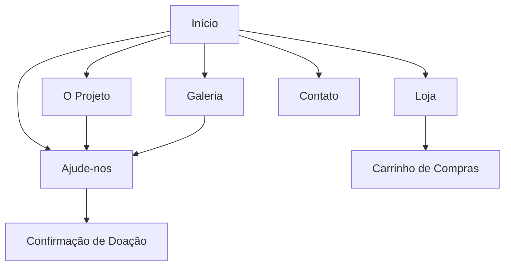

# Documento de Requisitos do Produto - Site ACLA

## 1. Visão Geral do Produto

O site da Associação Cirineu Levanta-te África (ACLA) é uma plataforma digital moderna e responsiva para promover evangelização e educação em Moçambique. O projeto visa divulgar as atividades da organização, facilitar a captação de doações e preparar a base para uma futura loja online.

- Objetivo principal: Criar presença digital profissional para amplificar o impacto da ACLA em Moçambique através de evangelização e educação.
- Público-alvo: Doadores potenciais, voluntários, comunidade cristã e pessoas interessadas em projetos sociais na África.
- Valor de mercado: Fortalecer a marca ACLA e aumentar o alcance das ações missionárias através de uma plataforma digital eficiente.

## 2. Funcionalidades Principais

### 2.1 Papéis de Usuário

| Papel | Método de Registro | Permissões Principais |
|-------|-------------------|----------------------|
| Visitante | Acesso direto | Navegar pelo site, visualizar conteúdo público, fazer doações |
| Doador Cadastrado | Formulário de contato/newsletter | Receber atualizações, histórico de doações, certificados |
| Administrador | Acesso interno | Gerenciar conteúdo, relatórios de doações, atualizações do site |

### 2.2 Módulos de Funcionalidade

Nosso site da ACLA consiste nas seguintes páginas principais:

1. **Página Inicial (Início)**: seção hero com missão da ACLA, navegação principal, destaques dos projetos, chamadas para ação de doação.
2. **O Projeto (Sobre Nós)**: história da ACLA, missão e visão, equipe, valores organizacionais, programas e iniciativas.
3. **Galeria**: imagens e vídeos dos projetos, galeria de fotos das atividades em Moçambique com categorias.
4. **Ajude-nos**: doações financeiras, voluntariado, doação de materiais, formas de contribuir.
5. **Loja**: futura loja online de camisetas e produtos da ACLA.
6. **Contato**: formulário de contato, informações de contato, localização com mapa, redes sociais.

#### Estrutura do Cabeçalho (Header)
- **Logo da ACLA**: Posicionada no canto superior esquerdo
- **Menu de Navegação Principal**: Início | O Projeto | Galeria | Ajude-nos | Loja | Contato

### 2.3 Detalhes das Páginas

#### Página Inicial (Home) - Estrutura Detalhada

**Seção Hero (Banner Principal)**
- Imagem de fundo inspiradora de crianças ou adultos em Moçambique aprendendo
- Título: "Transformando Vidas em Moçambique com Amor e Educação"
- Subtítulo: "Associação Cirineu Levanta-te África: Evangelização, Ensino e Esperança."
- Botão de ação: "Saiba Mais" (link para 'O Projeto')

**Seção Nossa Missão**
- Título: "Nossa Missão"
- Conteúdo: "A ACLA dedica-se a promover a evangelização, educação e desenvolvimento sustentável em Moçambique, oferecendo esperança e um futuro melhor para crianças e adultos através do ensino e do apoio comunitário."
- Cards de destaque com ícones:
  - **Evangelização**: "Fortalecendo a fé e disseminando a palavra de Deus nas comunidades."
  - **Educação**: "Oferecendo ensino de qualidade e alfabetização para todas as idades."
  - **Desenvolvimento**: "Capacitando indivíduos e famílias para um futuro mais próspero."

**Seção Últimas Notícias & Histórias**
- Título: "Últimas Notícias & Histórias"
- Cards de exemplo:
  - **Card 1**: (Foto: Crianças em sala de aula) Título: "Nova Turma de Alfabetização!" Resumo: "Nosso projeto Água Limpa concluiu com sucesso mais uma turma de alfabetização em 2023. Veja os depoimentos inspiradores!"
  - **Card 2**: (Foto: Grupo de pessoas construindo) Título: "Inauguração do Centro Comunitário" Resumo: "Com a ajuda de nossos voluntários, o novo centro comunitário já está em funcionamento, transformando a vida local."

**Call to Action (CTA) para Doação**
- Título: "Faça a Diferença Hoje!"
- Texto: "Sua contribuição é fundamental para continuarmos impactando vidas em Moçambique. Ajude-nos a construir um futuro mais brilhante."
- Botão: "Doar Agora" (link para 'Ajude-nos')

#### Página O Projeto (Sobre Nós) - Estrutura Detalhada

**Título Principal**: "Nosso Propósito, Sua Esperança"

**Seção Quem Somos**
- Título: "Sobre a ACLA"
- Conteúdo: "A Associação Cirineu Levanta-te África (ACLA) nasceu de um chamado para servir e transformar. Desde [Ano de Fundação], atuamos nas comunidades de Moçambique, levando educação, apoio espiritual e ferramentas para o desenvolvimento social e econômico. Acreditamos no potencial de cada indivíduo e na força da comunidade para construir um futuro próspero e cheio de esperança."

**Seção Nossa Visão e Valores**
- Título: "Visão e Valores"
- Visão: "Ser um farol de esperança e transformação em Moçambique, capacitando indivíduos para uma vida plena e autossuficiente."
- Valores: "Fé, Compromisso, Respeito, Educação, Solidariedade, Transparência."

**Seção Onde Atuamos**
- Título: "Nossas Comunidades"
- Conteúdo: "Atualmente, o projeto ACLA está presente em [Nome da Província/Cidade] e [Nome da Província/Cidade] em Moçambique, focando em áreas com maior necessidade de apoio educacional e social." (Incluir pequeno mapa ou lista)

**Seção Nossos Programas**
- Título: "Programas e Iniciativas"
- Cards/Descrições:
  - **Programa de Alfabetização**: "Aulas para crianças e adultos, focando na leitura, escrita e aritmética básica."
  - **Estudos Bíblicos e Evangelização**: "Encontros semanais para estudo da palavra e fortalecimento da fé."
  - **Capacitação Profissional**: "Workshops e cursos básicos em áreas como costura, agricultura e pequenos negócios."
  - **Saúde e Bem-Estar**: "Iniciativas de conscientização sobre higiene e acesso à água potável."

#### Página Galeria - Estrutura Detalhada

**Título**: "Momentos que Inspiram"

**Conteúdo**: Layout de grid ou carrossel para fotos e vídeos
**Categorias**: Educação, Comunidade, Eventos, Voluntários
**Funcionalidades**: Legendas e descrições para cada imagem/vídeo, filtros por categoria, lightbox para visualização ampliada

#### Página Ajude-nos - Estrutura Detalhada

**Título**: "Sua Ajuda Transforma Vidas!"

**Seção Como Você Pode Contribuir**
- Texto Introdutório: "Cada doação, por menor que seja, faz uma diferença real na vida de nossos irmãos e irmãs em Moçambique. Existem várias formas de você fazer parte desta causa."

**Seção Doação Financeira**
- Título: "Doação Financeira Direta"
- Conteúdo: "Sua doação pode ser feita via [Método de Pagamento, ex: PayPal, Transferência Bancária]. Escolha o valor que toca seu coração."
- Botões: "Doar Agora" (com opções de valores pré-definidos e campo para valor personalizado)
- Informações de Conta: Nome da conta, IBAN, SWIFT/BIC (a ser preenchido)

**Seção Seja um Voluntário**
- Título: "Voluntariado"
- Conteúdo: "Tem tempo e habilidades para compartilhar? Junte-se à nossa equipe de voluntários! Seja presencialmente em Moçambique ou à distância, sua ajuda é valiosa."
- Botão: "Seja um Voluntário" (link para formulário de contato)

**Seção Doe Materiais**
- Título: "Doação de Materiais"
- Conteúdo: "Aceitamos doações de materiais escolares, livros, roupas e outros itens essenciais. Entre em contato para saber como e onde entregar."
- Botão: "Entre em Contato para Doação de Materiais" (link para Contato)

#### Página Loja - Estrutura Inicial

**Título**: "Vista a Camisa, Apoie a Causa!"

**Conteúdo**: "Aqui você encontrará nossas camisetas exclusivas, desenhadas para celebrar a cultura moçambicana e o trabalho da ACLA. Cada compra ajuda a sustentar nossos projetos."
**Placeholder**: "Em breve, nossa coleção estará disponível! Fique ligado."
**Integração Futura**: Plataforma de e-commerce simplificada (Shopify Lite, PagSeguro Checkout) para gerenciamento de produtos e pagamentos

#### Página Contato - Estrutura Detalhada

**Título**: "Fale Conosco"

**Formulário de Contato**
- Campos: Nome, Email, Assunto, Mensagem
- Botão: "Enviar"
- Validação de campos obrigatórios

**Informações de Contato Adicionais**
- Email: info@aclamocambique.org
- Telefone: +258 xxx xxx xx3 (Placeholder)
- Endereço: [Endereço Físico em Moçambique - Placeholder]
- Mapa Incorporado: Google Maps com localização do projeto (se houver local físico de referência)

#### Página O Projeto (Sobre Nós) - Estrutura Detalhada

**Título Principal**: "Nosso Propósito, Sua Esperança"

**Seção Quem Somos**
- Título: "Sobre a ACLA"
- Conteúdo: "A Associação Cirineu Levanta-te África (ACLA) nasceu de um chamado para servir e transformar. Desde [Ano de Fundação], atuamos nas comunidades de Moçambique, levando educação, apoio espiritual e ferramentas para o desenvolvimento social e econômico. Acreditamos no potencial de cada indivíduo e na força da comunidade para construir um futuro próspero e cheio de esperança."

**Seção Nossa Visão e Valores**
- Título: "Visão e Valores"
- Visão: "Ser um farol de esperança e transformação em Moçambique, capacitando indivíduos para uma vida plena e autossuficiente."
- Valores: "Fé, Compromisso, Respeito, Educação, Solidariedade, Transparência."

**Seção Onde Atuamos**
- Título: "Nossas Comunidades"
- Conteúdo: "Atualmente, o projeto ACLA está presente em [Nome da Província/Cidade] e [Nome da Província/Cidade] em Moçambique, focando em áreas com maior necessidade de apoio educacional e social." (Incluir pequeno mapa ou lista)

**Seção Nossos Programas**
- Título: "Programas e Iniciativas"
- Cards/Descrições:
  - **Programa de Alfabetização**: "Aulas para crianças e adultos, focando na leitura, escrita e aritmética básica."
  - **Estudos Bíblicos e Evangelização**: "Encontros semanais para estudo da palavra e fortalecimento da fé."
  - **Capacitação Profissional**: "Workshops e cursos básicos em áreas como costura, agricultura e pequenos negócios."
  - **Saúde e Bem-Estar**: "Iniciativas de conscientização sobre higiene e acesso à água potável."

#### Página Galeria - Estrutura Detalhada

**Título**: "Momentos que Inspiram"

**Conteúdo**: Layout de grid ou carrossel para fotos e vídeos
**Categorias**: Educação, Comunidade, Eventos, Voluntários
**Funcionalidades**: Legendas e descrições para cada imagem/vídeo, filtros por categoria, lightbox para visualização ampliada

#### Página Ajude-nos - Estrutura Detalhada

**Título**: "Sua Ajuda Transforma Vidas!"

**Seção Como Você Pode Contribuir**
- Texto Introdutório: "Cada doação, por menor que seja, faz uma diferença real na vida de nossos irmãos e irmãs em Moçambique. Existem várias formas de você fazer parte desta causa."

**Seção Doação Financeira**
- Título: "Doação Financeira Direta"
- Conteúdo: "Sua doação pode ser feita via [Método de Pagamento, ex: PayPal, Transferência Bancária]. Escolha o valor que toca seu coração."
- Botões: "Doar Agora" (com opções de valores pré-definidos e campo para valor personalizado)
- Informações de Conta: Nome da conta, IBAN, SWIFT/BIC (a ser preenchido)

**Seção Seja um Voluntário**
- Título: "Voluntariado"
- Conteúdo: "Tem tempo e habilidades para compartilhar? Junte-se à nossa equipe de voluntários! Seja presencialmente em Moçambique ou à distância, sua ajuda é valiosa."
- Botão: "Seja um Voluntário" (link para formulário de contato)

**Seção Doe Materiais**
- Título: "Doação de Materiais"
- Conteúdo: "Aceitamos doações de materiais escolares, livros, roupas e outros itens essenciais. Entre em contato para saber como e onde entregar."
- Botão: "Entre em Contato para Doação de Materiais" (link para Contato)

#### Página Loja - Estrutura Inicial

**Título**: "Vista a Camisa, Apoie a Causa!"

**Conteúdo**: "Aqui você encontrará nossas camisetas exclusivas, desenhadas para celebrar a cultura moçambicana e o trabalho da ACLA. Cada compra ajuda a sustentar nossos projetos."
**Placeholder**: "Em breve, nossa coleção estará disponível! Fique ligado."
**Integração Futura**: Plataforma de e-commerce simplificada (Shopify Lite, PagSeguro Checkout) para gerenciamento de produtos e pagamentos

#### Página Contato - Estrutura Detalhada

**Título**: "Fale Conosco"

**Formulário de Contato**
- Campos: Nome, Email, Assunto, Mensagem
- Botão: "Enviar"
- Validação de campos obrigatórios

**Informações de Contato Adicionais**
- Email: info@aclamocambique.org
- Telefone: +258 xxx xxx xx3 (Placeholder)
- Endereço: [Endereço Físico em Moçambique - Placeholder]
- Mapa Incorporado: Google Maps com localização do projeto (se houver local físico de referência)

#### Rodapé (Footer) - Estrutura

**Direitos Autorais**: © 2024 ACLA. Todos os direitos reservados.
**Links Rápidos**: Início, O Projeto, Ajude-nos, Contato
**Ícones de Redes Sociais**: Facebook, Instagram, YouTube
**Elemento Visual**: Pequeno mapa do continente africano, alinhado à identidade da logo

### 2.3 Detalhes das Páginas

| Nome da Página | Nome do Módulo | Descrição da Funcionalidade |
|----------------|----------------|-----------------------------|
| Início (Home) | Seção Hero | Imagem de fundo inspiradora, título "Transformando Vidas em Moçambique com Amor e Educação", botão "Saiba Mais" |
| Início (Home) | Nossa Missão | Cards com ícones para Evangelização, Educação e Desenvolvimento com descrições |
| Início (Home) | Últimas Notícias | Cards de notícias com fotos, títulos e resumos dos projetos recentes |
| Início (Home) | CTA Doação | Seção "Faça a Diferença Hoje!" com botão "Doar Agora" em destaque |
| O Projeto | Quem Somos | Seção "Sobre a ACLA" com história e propósito da organização |
| O Projeto | Visão e Valores | Declaração de visão e lista de valores organizacionais |
| O Projeto | Onde Atuamos | Mapa/lista das comunidades atendidas em Moçambique |
| O Projeto | Nossos Programas | Cards com Alfabetização, Evangelização, Capacitação e Saúde |
| Galeria | Grid de Mídia | Layout responsivo para fotos e vídeos com lightbox |
| Galeria | Categorias | Filtros por Educação, Comunidade, Eventos, Voluntários |
| Galeria | Legendas | Descrições e contexto para cada imagem/vídeo |
| Ajude-nos | Doação Financeira | Formulário com valores pré-definidos e personalizado, informações bancárias |
| Ajude-nos | Voluntariado | Seção para recrutamento de voluntários com formulário |
| Ajude-nos | Doação de Materiais | Informações sobre doação de itens físicos com contato |
| Loja | Placeholder | Mensagem "Em breve" com descrição da futura loja de camisetas |
| Loja | Integração E-commerce | Preparação para plataforma Shopify Lite ou PagSeguro |
| Contato | Formulário | Campos Nome, Email, Assunto, Mensagem com validação |
| Contato | Informações | Email info@aclamocambique.org, telefone, endereço |
| Contato | Mapa Google | Localização incorporada do projeto em Moçambique |
| Rodapé | Direitos Autorais | © 2024 ACLA. Todos os direitos reservados |
| Rodapé | Links Rápidos | Navegação para Início, O Projeto, Ajude-nos, Contato |
| Rodapé | Redes Sociais | Ícones Facebook, Instagram, YouTube |
| Rodapé | Mapa África | Elemento visual do continente africano alinhado à logo |

## 3. Processo Principal

**Fluxo do Visitante/Doador:**
O usuário acessa a página inicial (Início), conhece a missão da ACLA através da seção hero e cards de missão. Pode clicar em "Saiba Mais" para ir para "O Projeto" e conhecer melhor a organização, navegar para "Galeria" para ver fotos e vídeos das atividades, ou ir direto para "Ajude-nos" para contribuir. Quando decidir doar, preenche o formulário e realiza o pagamento. Pode também entrar em contato através da página "Contato" ou futuramente acessar a "Loja" para comprar produtos.

**Fluxo do Administrador:**
Acessa painel administrativo, atualiza conteúdo das páginas, gerencia galeria de imagens e vídeos, monitora doações recebidas e gera relatórios de transparência.

## 4. Design da Interface do Usuário

### 4.1 Estilo de Design

- **Cores Primárias e Secundárias:**
  - Verde Principal: #00796B (seções principais, rodapé, elementos de navegação)
  - Amarelo de Destaque: #FFD700 (botões secundários, títulos de destaque, links hover)
  - Vermelho de Ação: #B71C1C (botão "Doar Agora", alertas, CTAs importantes)
  - Branco: #FFFFFF (fundos principais, texto em fundos escuros)
  - Cinza Claro: #F5F5F5 (fundos de seção, cards)
  - Cinza Escuro: #333333 (textos principais, ícones)

- **Estilo de Botões:** Bordas arredondadas (8px), sombra sutil, transições suaves de 0.3s
- **Fonte e Tamanhos Preferidos:**
  - Títulos: Poppins (32px-48px para H1, 24px-32px para H2)
  - Corpo: Open Sans (16px para texto principal, 14px para legendas)
- **Estilo de Layout:** Design baseado em cards, navegação superior fixa, grid responsivo
- **Sugestões de Emoji/Ícones:** Ícones minimalistas do Feather Icons, emojis relacionados à África (🌍, ❤️, 🙏, 📚)

### 4.2 Visão Geral do Design das Páginas

| Nome da Página | Nome do Módulo | Elementos de UI |
|----------------|----------------|----------------|
| Início | Seção Hero | Fundo com imagem inspiradora de Moçambique, overlay verde (#00796B com 80% opacidade), título "Transformando Vidas em Moçambique com Amor e Educação" em Poppins branco, botão amarelo "Saiba Mais" |
| Início | Nossa Missão | Cards brancos com sombra sutil, ícones verdes, títulos em amarelo (#FFD700), texto cinza escuro |
| Início | Últimas Notícias | Cards com imagens 16:9, títulos em verde escuro, resumos em cinza, hover com elevação |
| Início | CTA Doação | Fundo verde (#00796B), título "Faça a Diferença Hoje!" em branco, botão vermelho "Doar Agora" (#B71C1C) |
| O Projeto | História | Timeline vertical com ícones circulares verdes, texto Open Sans, fundos alternados |
| Galeria | Grid de Imagens | Grid responsivo 3 colunas desktop/1 coluna mobile, hover com overlay amarelo, lightbox |
| Ajude-nos | Formulário | Card centralizado branco, inputs com borda verde, botão vermelho destacado, ícones de pagamento |
| Loja | Catálogo | Grid de produtos com cards brancos, preços em verde, botões amarelos "Adicionar" |
| Contato | Informações | Card lateral com fundo cinza claro, ícones verdes, texto cinza escuro |

### 4.3 Responsividade e Orientações Técnicas

**Responsividade**
O site é mobile-first com adaptação para desktop. Otimizado para interação touch em dispositivos móveis, com botões de tamanho adequado (mínimo 44px) e navegação por gestos. Breakpoints: 320px (mobile), 768px (tablet), 1024px (desktop).

**Acessibilidade**
- Implementar tags semânticas HTML5 (header, nav, main, section, article, footer)
- Atributos alt descritivos para todas as imagens
- Contraste adequado entre texto e fundo (mínimo 4.5:1)
- Navegação por teclado funcional
- Estrutura de headings hierárquica (H1, H2, H3)
- Labels apropriados para formulários
- Foco visível em elementos interativos

**Otimização de Performance**
- Compressão de imagens (WebP, AVIF quando possível)
- Lazy loading para imagens e vídeos
- Minificação de CSS e JavaScript
- Otimização de fontes (font-display: swap)
- Carregamento assíncrono de recursos não críticos

**JavaScript e Interatividade**
- Menu hambúrguer responsivo para mobile
- Carrossel/slider para galeria de imagens
- Validação de formulários em tempo real
- Scroll suave entre seções
- Lightbox para galeria de fotos
- Transições CSS suaves (0.3s ease)
- Manter minimalismo e performance

**Observações Importantes**
- Todo conteúdo textual são placeholders a serem substituídos pelos dados reais da ACLA
- Imagens serão fornecidas pela organização
- Informações de contato (telefone, endereço) serão atualizadas
- Integração de pagamento será implementada conforme necessidade
- Loja online será desenvolvida em fase posterior