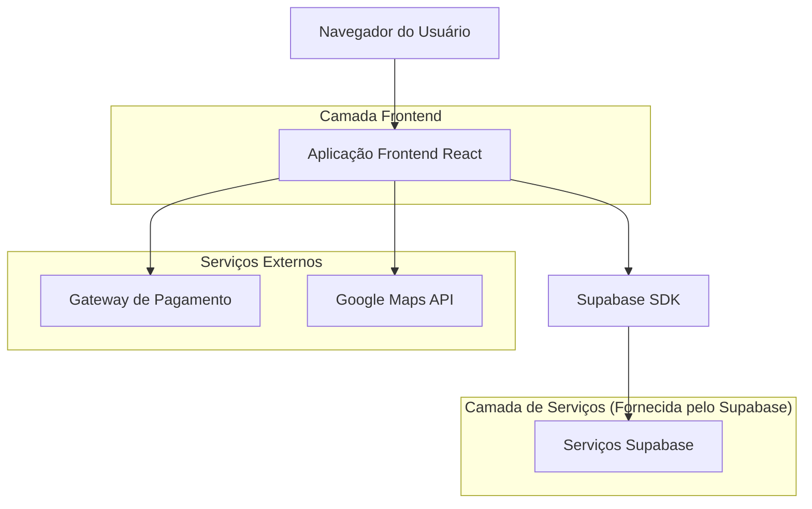
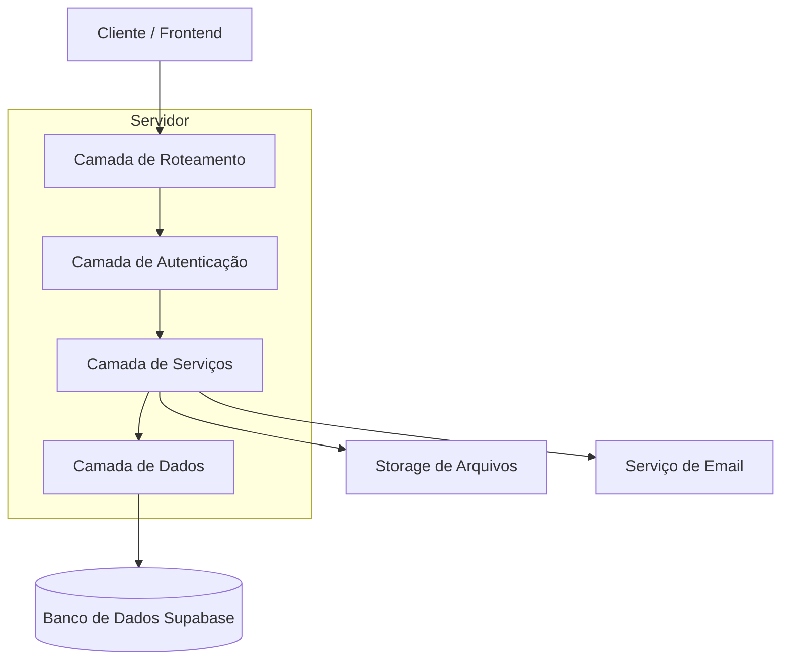
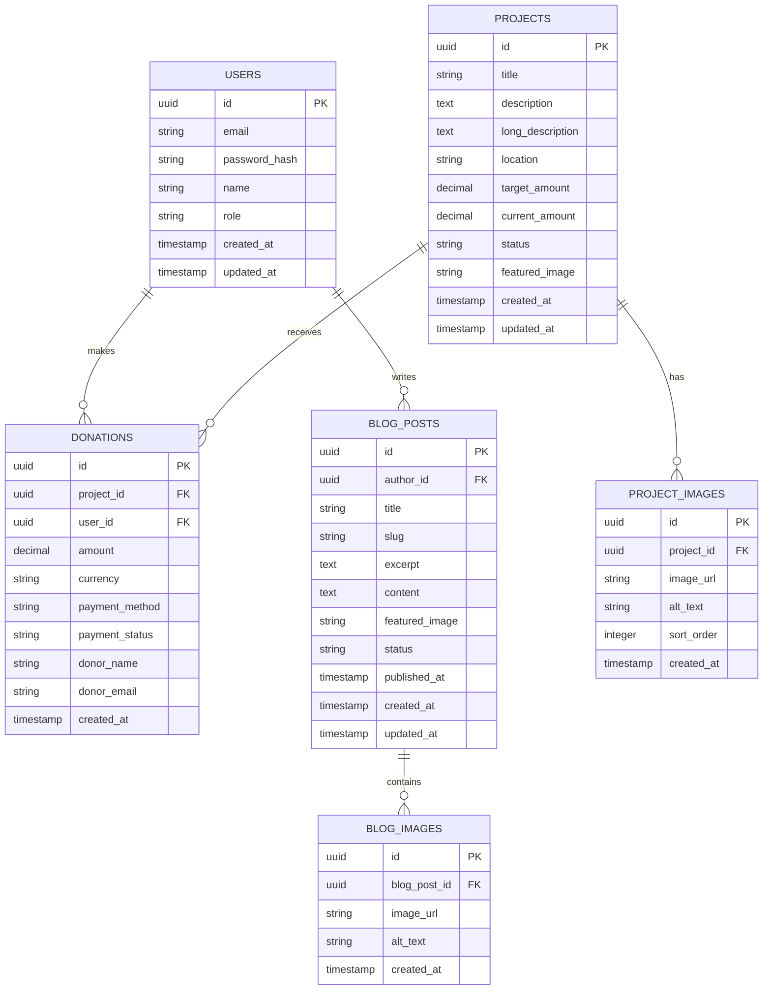

# Documento de Arquitetura Técnica - Site ACLA

## 1. Design da Arquitetura



## 2. Descrição da Tecnologia

- **Frontend:** React@18 + TailwindCSS@3 + Vite
- **Backend:** Supabase (autenticação, banco de dados, storage)
- **Pagamentos:** Stripe/PayPal (integração via API)
- **Mapas:** Google Maps API
- **Hospedagem:** Vercel/Netlify (frontend), Supabase (backend)

## 3. Definições de Rotas

| Rota | Propósito |
|------|----------|
| / | Página inicial (Início), exibe seção hero, missão da ACLA e últimas notícias |
| /o-projeto | Página sobre a organização, história da ACLA e equipe |
| /galeria | Galeria de imagens e vídeos das atividades em Moçambique |
| /ajude-nos | Página de doações com formulários e métodos de pagamento |
| /loja | Futura loja online de camisetas e produtos da ACLA |
| /contato | Página de contato com formulário e informações |
| /admin | Painel administrativo para gerenciamento de conteúdo |
| /admin/galeria | Gerenciamento de imagens e vídeos (CRUD) |
| /admin/doacoes | Relatórios e gestão de doações |
| /admin/loja | Gerenciamento de produtos da loja (futuro) |

## 4. Definições de API

### 4.1 API Principal

**Autenticação de usuário**
```
POST /auth/login
```

Request:
| Nome do Parâmetro | Tipo do Parâmetro | Obrigatório | Descrição |
|-------------------|-------------------|-------------|----------|
| email | string | true | Email do administrador |
| password | string | true | Senha (texto plano, será criptografada) |

Response:
| Nome do Parâmetro | Tipo do Parâmetro | Descrição |
|-------------------|-------------------|----------|
| success | boolean | Status da autenticação |
| user | object | Dados do usuário autenticado |
| token | string | Token de acesso JWT |

Exemplo:
```json
{
  "email": "admin@acla.org",
  "password": "senha123"
}
```

**Gestão de Projetos**
```
GET /api/projects
POST /api/projects
PUT /api/projects/:id
DELETE /api/projects/:id
```

**Gestão de Doações**
```
POST /api/donations
GET /api/donations (admin only)
```

**Gestão de Blog**
```
GET /api/blog
POST /api/blog (admin only)
PUT /api/blog/:id (admin only)
DELETE /api/blog/:id (admin only)
```

## 5. Diagrama da Arquitetura do Servidor



## 6. Modelo de Dados

### 6.1 Definição do Modelo de Dados



### 6.2 Linguagem de Definição de Dados

**Tabela de Usuários (users)**
```sql
-- criar tabela
CREATE TABLE users (
    id UUID PRIMARY KEY DEFAULT gen_random_uuid(),
    email VARCHAR(255) UNIQUE NOT NULL,
    password_hash VARCHAR(255) NOT NULL,
    name VARCHAR(100) NOT NULL,
    role VARCHAR(20) DEFAULT 'admin' CHECK (role IN ('admin', 'editor')),
    created_at TIMESTAMP WITH TIME ZONE DEFAULT NOW(),
    updated_at TIMESTAMP WITH TIME ZONE DEFAULT NOW()
);

-- criar índices
CREATE INDEX idx_users_email ON users(email);
CREATE INDEX idx_users_role ON users(role);

-- permissões
GRANT SELECT ON users TO anon;
GRANT ALL PRIVILEGES ON users TO authenticated;
```

**Tabela de Projetos (projects)**
```sql
-- criar tabela
CREATE TABLE projects (
    id UUID PRIMARY KEY DEFAULT gen_random_uuid(),
    title VARCHAR(200) NOT NULL,
    description TEXT NOT NULL,
    long_description TEXT,
    location VARCHAR(100),
    target_amount DECIMAL(10,2) DEFAULT 0,
    current_amount DECIMAL(10,2) DEFAULT 0,
    status VARCHAR(20) DEFAULT 'active' CHECK (status IN ('active', 'completed', 'paused')),
    featured_image TEXT,
    created_at TIMESTAMP WITH TIME ZONE DEFAULT NOW(),
    updated_at TIMESTAMP WITH TIME ZONE DEFAULT NOW()
);

-- criar índices
CREATE INDEX idx_projects_status ON projects(status);
CREATE INDEX idx_projects_created_at ON projects(created_at DESC);

-- permissões
GRANT SELECT ON projects TO anon;
GRANT ALL PRIVILEGES ON projects TO authenticated;

-- dados iniciais
INSERT INTO projects (title, description, location, target_amount, status) VALUES
('Educação Infantil em Maputo', 'Projeto de alfabetização para crianças em comunidades carentes de Maputo', 'Maputo, Moçambique', 5000.00, 'active'),
('Centro de Evangelização Rural', 'Construção de centro comunitário para atividades religiosas e educacionais', 'Província de Gaza', 8000.00, 'active'),
('Capacitação de Professores', 'Treinamento de educadores locais em metodologias modernas de ensino', 'Beira, Moçambique', 3000.00, 'active');
```

**Tabela de Doações (donations)**
```sql
-- criar tabela
CREATE TABLE donations (
    id UUID PRIMARY KEY DEFAULT gen_random_uuid(),
    project_id UUID REFERENCES projects(id),
    user_id UUID REFERENCES users(id),
    amount DECIMAL(10,2) NOT NULL,
    currency VARCHAR(3) DEFAULT 'BRL',
    payment_method VARCHAR(50),
    payment_status VARCHAR(20) DEFAULT 'pending' CHECK (payment_status IN ('pending', 'completed', 'failed', 'refunded')),
    donor_name VARCHAR(100),
    donor_email VARCHAR(255),
    created_at TIMESTAMP WITH TIME ZONE DEFAULT NOW()
);

-- criar índices
CREATE INDEX idx_donations_project_id ON donations(project_id);
CREATE INDEX idx_donations_created_at ON donations(created_at DESC);
CREATE INDEX idx_donations_payment_status ON donations(payment_status);

-- permissões
GRANT SELECT ON donations TO authenticated;
GRANT INSERT ON donations TO anon;
GRANT ALL PRIVILEGES ON donations TO authenticated;
```

**Tabela de Posts do Blog (blog_posts)**
```sql
-- criar tabela
CREATE TABLE blog_posts (
    id UUID PRIMARY KEY DEFAULT gen_random_uuid(),
    author_id UUID REFERENCES users(id),
    title VARCHAR(200) NOT NULL,
    slug VARCHAR(200) UNIQUE NOT NULL,
    excerpt TEXT,
    content TEXT NOT NULL,
    featured_image TEXT,
    status VARCHAR(20) DEFAULT 'draft' CHECK (status IN ('draft', 'published', 'archived')),
    published_at TIMESTAMP WITH TIME ZONE,
    created_at TIMESTAMP WITH TIME ZONE DEFAULT NOW(),
    updated_at TIMESTAMP WITH TIME ZONE DEFAULT NOW()
);

-- criar índices
CREATE INDEX idx_blog_posts_slug ON blog_posts(slug);
CREATE INDEX idx_blog_posts_status ON blog_posts(status);
CREATE INDEX idx_blog_posts_published_at ON blog_posts(published_at DESC);

-- permissões
GRANT SELECT ON blog_posts TO anon;
GRANT ALL PRIVILEGES ON blog_posts TO authenticated;

-- dados iniciais
INSERT INTO blog_posts (title, slug, excerpt, content, status, published_at) VALUES
('Início da Missão ACLA em Moçambique', 'inicio-missao-acla-mocambique', 'Conheça como começou nossa jornada de evangelização e educação na África', 'Conteúdo completo do artigo sobre o início da missão...', 'published', NOW()),
('Impacto da Educação nas Comunidades Rurais', 'impacto-educacao-comunidades-rurais', 'Veja os resultados transformadores da educação em áreas remotas', 'Conteúdo detalhado sobre o impacto educacional...', 'published', NOW());
```